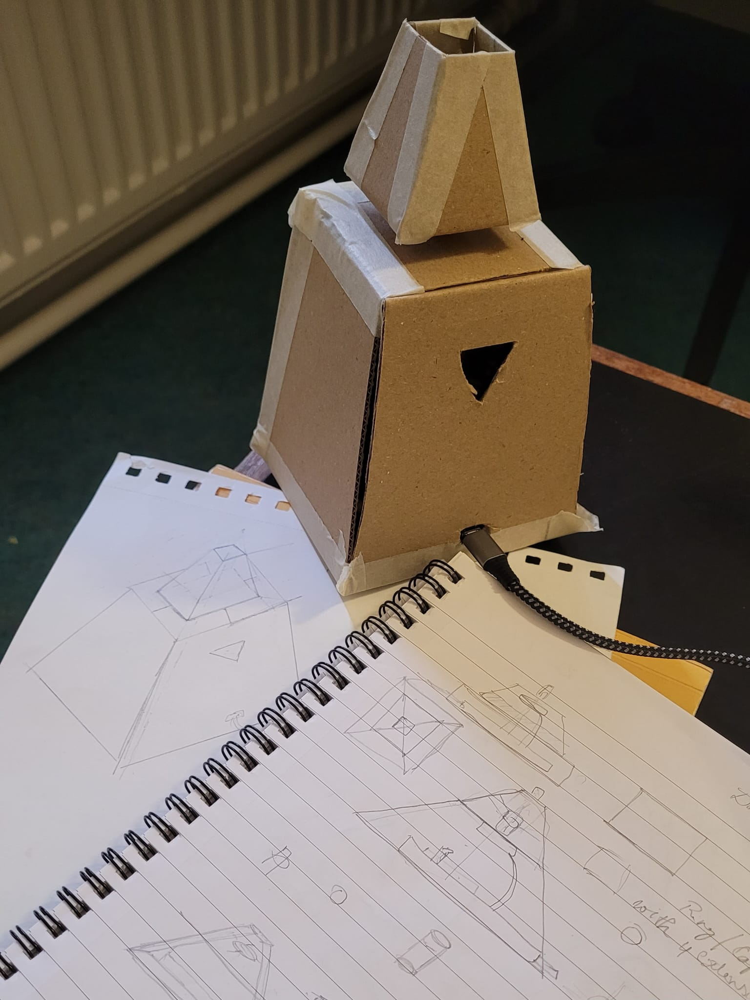
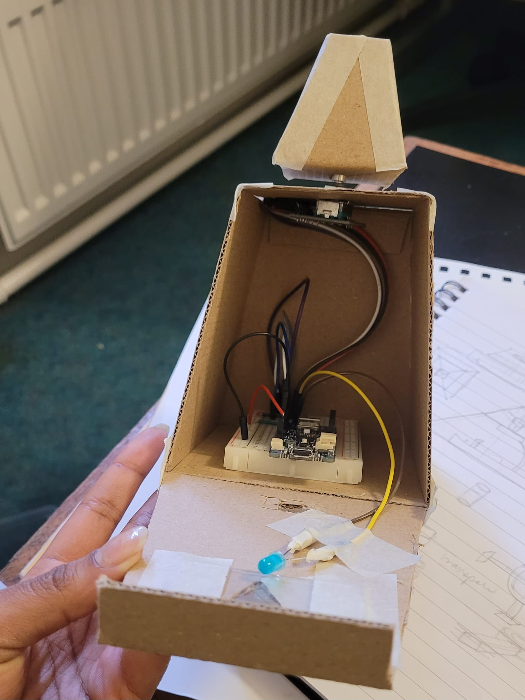
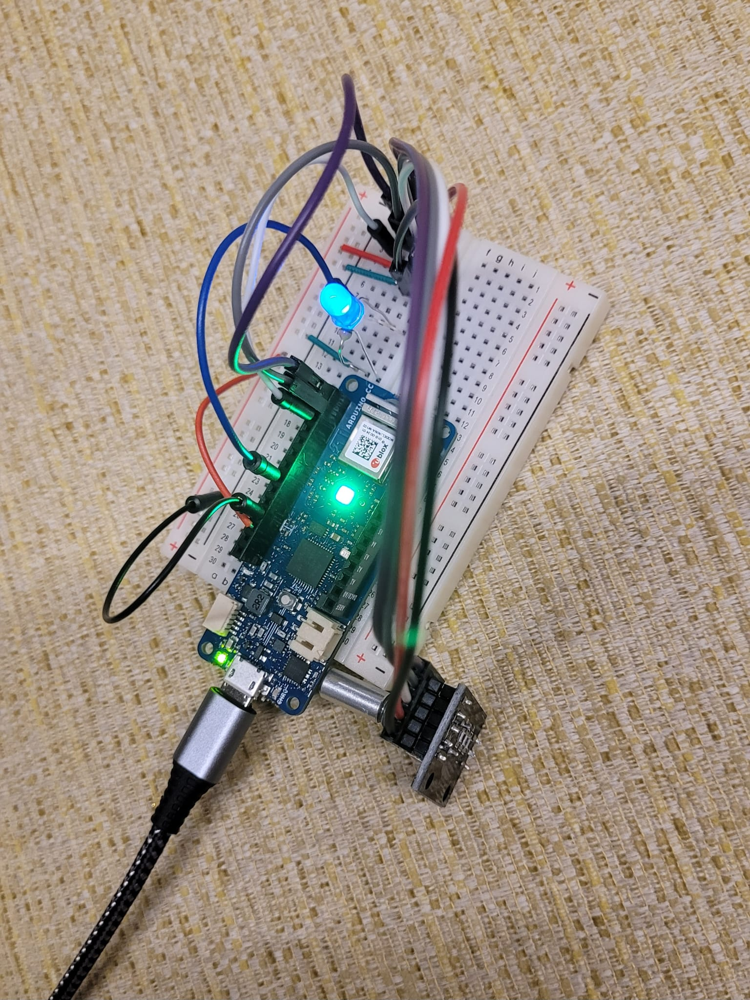

# Pyramid of Elements

This device represents motion, light and transformation by depicting the four elements of states - Fire, Earth, Water and Air as dynamic colours controlled by a rotary encoder.
The pyramid is an Arduino light controller for the device [Vespera]([url](https://github.com/ucl-casa-ce/casa0014/tree/main/vespera)), which displays the play of hues as a dynamic element, exploring the primal forces that shape existence through a simple act of rotation.

# What's in this repository?
- Source code of the Pyramin of Elements
- Test codes
- List of Hardware and Software Specifications
- Instructions to Reproduce
- Prototype sketches and concepts

# How to interact with the pyramid?
Rotate the Pyramid head to match the RGB colours on the controller. This outputs the hues of the matched side of the pyramid to Vespera, which then shows an abstract depiction of the element representing the colour. The four elements, Fire, Earth, Water and Air are mapped to Red, Green, Blue and Mixed Hues, respectively, on the pyramid to showcase the light play.

#System Overview
The Pyramid is a rotary encoder device that remotely controls a light system over Wifi. Built on Arduino MKR 1010 and sending data via the MQTT protocol.
The step turnings in the encoder are mapped to the physical side/face of the pyramid that provides visual identification on which hue to play on the Vespera. The RGB values read from the device are published as an array containing RGB and pixel index, and sent as an MQTT message to the MQTT Broker via Wi-Fi, which the Vespera subscribes to map out the outputs among the 72 NeoPixel LEDs present.
The controller can be turned in a clockwise or counterclockwise direction. 
A blue LED indicator confirms the physical positioning of the device and indicates that the device is "ON".

## Component Breakdown
List of Hardware and Software used:

### Hardware Specifications
- Vespera luminaire- A WiFi-enabled light display that can be controlled via MQTT messages.
- Arduino MKR1010 microcontroller
- KY-040 Rotary Encoder
- Blue LED

### Development Environment
- Arduino IDE

# How to reproduce this?

## Files and Folder contained here
### Folder
- controller/src/ is the source file with the latest code
- tests/ contains the test codes and improvements done during development
### Files
-  rotary_encoder.ino contains Arduino code to interact with the encoder to send the required output
-  connections.ino contains connection establishment protocols with the Vespera device
-  RGBLED.ino contains default colour display values
  
## Install the following packages:
- [WiFiNINA](https://docs.arduino.cc/libraries/wifinina/)  - Enables network connection
- [SPI](https://docs.arduino.cc/language-reference/en/functions/communication/SPI/) - This library allows you to communicate with SPI devices, with the Arduino board as the controller device
- [PubSubClient](https://docs.arduino.cc/libraries/pubsubclient/) - Make MQTT Connection

## Run Instructions
- Clock GitHub with `git-clone` and navigate to controller/src/rotary_encoder/
- Create a file called "arduino_secrets.h" to store the SSID and Passwords of the MQTT Broker and Network

# Prototype sketches and Concepts

The concept of drawing parallels between the four elements of life that construct the essence of growth and its broadening to creativity, curiosity and experimentation is a concept I wanted to represent as a physical object. A device that subtly mimics the environment while constantly upholding the complex dynamics. This pushed me to look at RGB lights as a representation of the elements. Pyramid was chosen as my object as it represent upward motion, while its structure is strong enough to contain continuous physical movement. I saw that as a common ground between evolution, where the environmental primary factors are always changing, yet remain on a strong foundation.

The Arduino wiring, along with the encoder, is taped within the cardboard 

Arduino on breadboard

